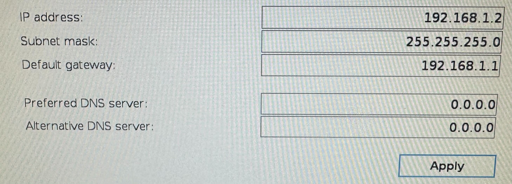
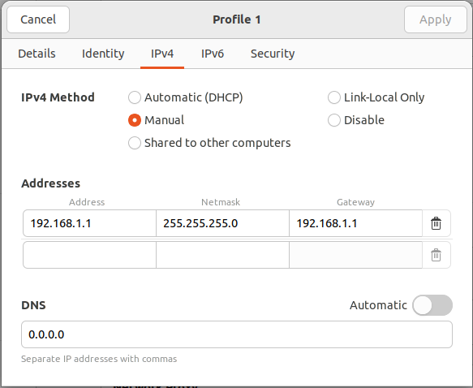
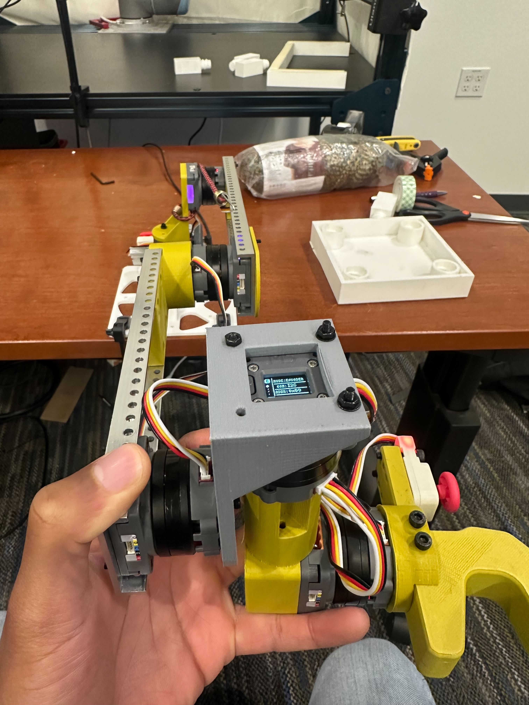
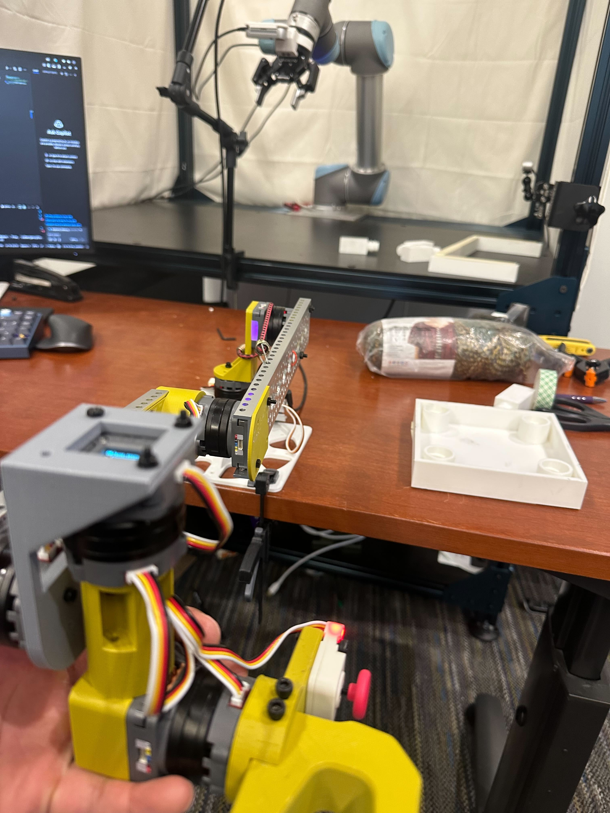
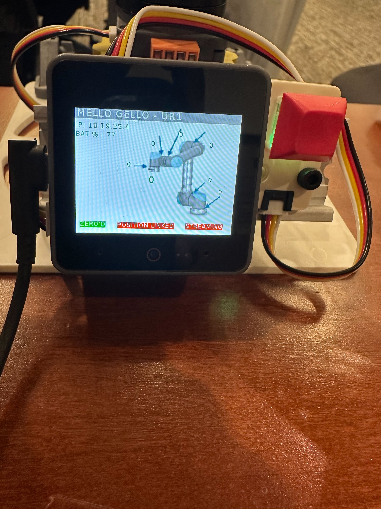
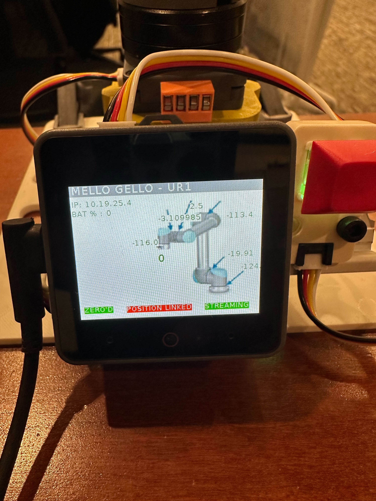

# Universal Robots Behavior Cloning Stack

## Connecting to the arm via ethernet

1. Make sure IP address, subnet, and default gateway are set correctly.



2. Make sure local network subnet matches IP subnet



3. ping robot ip to make sure connection is established

4. Run ```python scripts/get_joint_positions.py``` to ensure arm can be reached via URX (may have to edit arm ip in script)

## Connecting to Gripper via USB

#### Only necessary if gripper is connected directly via USB and not into the arm.

1. Change gripper permissions: ```sudo chmod 777 /dev/ttyUSB0```

2. Verify gripper can be controlled via modbus: ```python scripts/test_2f_85.py```

## Teleop

### Calibrate Mello

1. Place Mello into below position and while holding it in this position, press and hold the red button for a few seconds.




After pressing and holding the red button, you will know calibration is complete as the ZERO indicator on the screen will now be green




### Stream joint positions from Mello

1. Unlock permissions for the Mello Port

    ```sudo chmod 777 /dev/serial/by-id/usb-M5Stack_Technology_Co.__Ltd_M5Stack_UiFlow_2.0_24587ce945900000-if00```

2. Double tap the red button to stream joint positions. The streaming indicator on the screen will turn green



3. ```python scripts\test_mello.py``` (should see joint positions getting streamed)


### Teleop the arm

```python scripts/mello_teleop.py```

#### Note that for UR5 CB2 you will also have to start the modbus_control.urp script. Make sure Mello is in a good position before starting script as arm will jump to Mello position.

## Camera Calibration

### Testing Realsense Camera

Can check stream for realsense camera (modify id in script) ```python scripts/stream_realsense.py```

### Calibrate the camera

```python scripts/pc_calibration.py```

The arm will move to many positions (can toggle this inside the file). At each position select the gripper in the image then press any key to continue, or press enter to skip current position.

### View calibration

Matrices for each calibration as well as the final transformation matrix are saved in the calibration_data/ folder

To view calibration accuracy ```python scripts/visualize_calibration.py```. Blue and green points close to eachother means the predicted values are good and the calibration was successful.

## Data Collection

### Collecting Data

For data collection run ```python scripts/collect_data.py```. Can modify collection frequency or whether or not to use the camera. For Implementation details refer to the ```DataCollectionInterface```.

### Replaying Data

#### Create video from any trajectory

```python scripts/visualize_trajectory.py```

#### Replay Trajectory in the real world

```python scripts/replay_trajectory.py```
